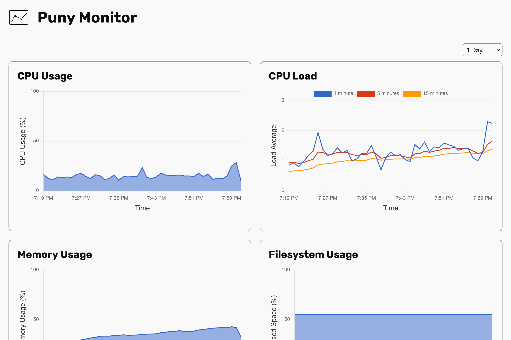

<div align="center">

# Puny Monitor

### A batteries-included monitoring tool for single hosts.

</div>

<p align="center">
  
</p>

## Features

- Just enough data to be useful 🔍
- Install in 30 seconds 🏎️
- Perfect for [Kamal](https://kamal-deploy.org/) and other containerized setups 🐋


## Getting Started

Puny Monitor works best with Docker. Run this command to check it out quickly: 

```
docker run --rm \
  -v=/:/host:ro,rslave -v=puny-data:/puny-monitor/db \
  -e HOST_PATH=/host \
  -p 4567:4567 \
  hschne/puny-monitor:latest
```

Visit [localhost:4567](http://localhost:4567) to check your system data. To see how to deploy Puny Monitor in a production environment see [Deployment].

## Authentication

Puny monitor supports Basic HTTP Authentication. To enable authentication set both the `PUNY_USERNAME` and `PUNY_PASSWORD` environment variables. For example, using with `docker run`:

```
docker run --rm \
  -v=/:/host:ro,rslave -v=puny-data:/puny-monitor/db \
  -e HOST_PATH=/host \
  -e PUNY_USERNAME=admin \
  -e PUNY_PASSWORD=secret \
  -p 4567:4567 \
  hschne/puny-monitor:latest
```

## Deployment

Puny Monitor was made with [Kamal](https://kamal-deploy.org/) and [Ruby on Rails](https://rubyonrails.org/) in mind. It is recommended that you deploy it as an accessory to your application. Add the following lines to `config/deploy.yml`:

```
accessories:
  puny-monitor:
    image: hschne/puny-monitor:latest
    host: <host>
    port: "127.0.0.1:4567:4567"
    volumes:
      - /:/host:ro,rslave
      - puny-monitor-data:/puny-monitor/db
      
aliases:
  add-puny-monitor-to-proxy: |
    server exec docker exec kamal-proxy kamal-proxy deploy puny-monitor 
    --target "<your-service-name>-puny-monitor:4567"
    --host "puny-monitor.<your-domain>"
    --tls
```

Then run `kamal-proxy` to point to Puny Monitor: 

```
kamal add-puny-monitor-to-proxy
```

### Other Deployment Options

You may install the Puny Monitor gem and run the application from the command line. 

```bash
gem install puny-monitor
# Run puny monitor on port 4567
puny-monitor
```

## Why Puny Monitor? 

Puny Monitor aims to be a dead-simple, no-frills monitoring solution for single hosts. It provides enough information to be useful (and not a bit more) and avoids the complications and overhead that come with existing solutions. 

To put it simply, Puny Monitor replicates [Digital Ocean's Monitoring](https://www.digitalocean.com/products/monitoring) but runs on any ol' VPS or metal server you might have lying around. It is the perfect solution for IndieHackers who use Rails & Kamal, but works beautifully for anyone that wants some useful monitoring quickly. 

## Development

After checking out the repo, run `bin/setup` to install dependencies. Then, run `rake test` to run the tests. You can also run `bin/console` for an interactive prompt that will allow you to experiment.

To install this gem onto your local machine, run `bundle exec rake install`.  To run Puny Monitor locally use 
```
bundle exec rackup
```

Alternatively, you may use the various docker helpers defined in the [Rakefile].

To release a new version, update the version number in `version.rb`, and then run `bundle exec rake release`, which will create a git tag for the version, push git commits and the created tag, and push the `.gem` file to [rubygems.org](https://rubygems.org).

## Contributing

Bug reports and pull requests are welcome on GitHub at https://github.com/[USERNAME]/puny-monitor. This project is intended to be a safe, welcoming space for collaboration, and contributors are expected to adhere to the [code of conduct](https://github.com/[USERNAME]/puny-monitor/blob/main/CODE_OF_CONDUCT.md).

## License

The gem is available as open source under the terms of the [MIT License](https://opensource.org/licenses/MIT).

## Code of Conduct

Everyone interacting in the Puny::Monitor project's codebases, issue trackers, chat rooms and mailing lists is expected to follow the [code of conduct](https://github.com/[USERNAME]/puny-monitor/blob/main/CODE_OF_CONDUCT.md).
